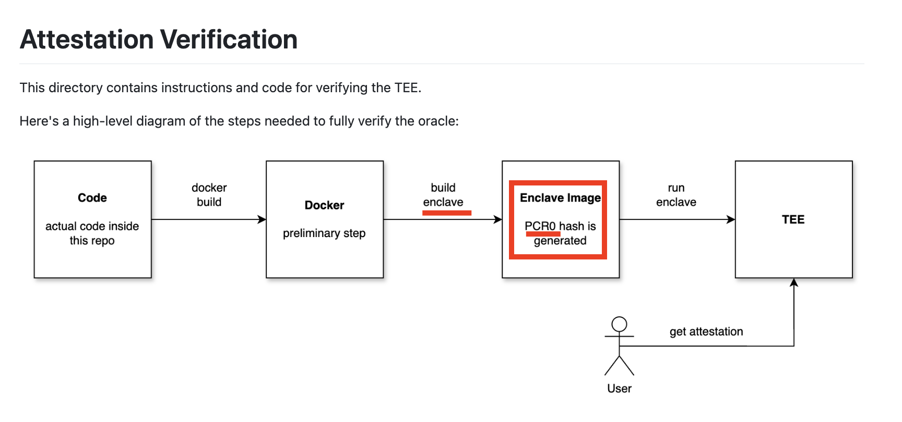

# 1 Git clone

`git clone https://github.com/galadriel-ai/Sentience.git`

`cd Sentience/verified-inference/verify`

# 2 Set a virtual environment

### 1 create an environment

`python3 -m venv venv`

### 2 set activate

`source venv/bin/activate`

# 3 Install requirnments

`pip install -r requirements.txt`

# 4 verify



```
python verify.py --pcr0_hash a3575880471781514c83935ee77dd8fc710512daf5d306ccee2c2abb0985e35fea0843f0e950a74f8d17541fc66dd0e4 --attestation <your attestation>
```

change pcr0_hash
